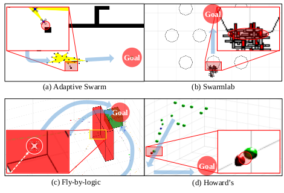

# Source code 

This page contains Swarmbug's source code and additional profiling tools mentioned in the paper (with example inputs/data).

## Implementation of Swarmbug

### Supported algorithms

| No.  |   Algorithm    |              Description               | Swarmbug's code |                     Original Source                     |
| :-: | :------------- | :------------------------------------- | :---: |:-----------------------------------------------------: |
| A1  | Adaptive Swarm | Flight avoiding static & dynamic obst. | [Link](./A1_Adaptive_Swarm) |[Link](https://github.com/RuslanAgishev/adaptive_swarm) |
| A2  |    Swarmlab    |    Flight avoiding static obstacle     | [Link](./A2_Swarmlab) |     [Link](https://github.com/lis-epfl/swarmlab)       |
| A3  |  Fly-by-logic  |  Optimizing path avoiding unsafe zone  | [Link](./A3_Flybylogic) |    [Link](https://github.com/yashpant/FlyByLogic)      |
| A4  |    Howard's    |    Flight avoiding static obstacle     | [Link](./A4_Howard) | [Link](https://github.com/choward1491/SwarmAlgorithms)  |

* Each folder contains the summary of changed code focusing crucial primitives (e.g., how we compute the Dcc).
* There is a quick start guide to see buggy behaviors (below) and corresponding Dcc values.

Note that the above swarm algorithms may require some dependent packages. If you do not have those, you may encounter dependency-related issues. In such a case, please see the original source repository to solve the issues.
More details about each algorithm and buggy behaviors are placed in the early part of Section 5 (Evaluation) in the paper.

1. **[A1_Adaptive_Swarm](./A1_Adaptive_Swarm)**.
2. **[A2_Swarmlab](./A2_Swarmlab)**.
3. **[A3_Flybylogic](./A3_Flybylogic)**.
4. **[A4_Howard](./A4_Howard)**.

## Additional Tools (including profiling tools)

This folder has tools what we used in this project. Note that in Section 4.1.1, we mentioned that we provide profiling tools/methods for configuration definitions. This contains those tools/methods as well.
Specifically, it contains tools for data preprocessing, map creation (e.g., SVMap), data analysis (profiling), and data handling.
Most tools are based on R.

- **[Additional Tools](./Tools)**.
