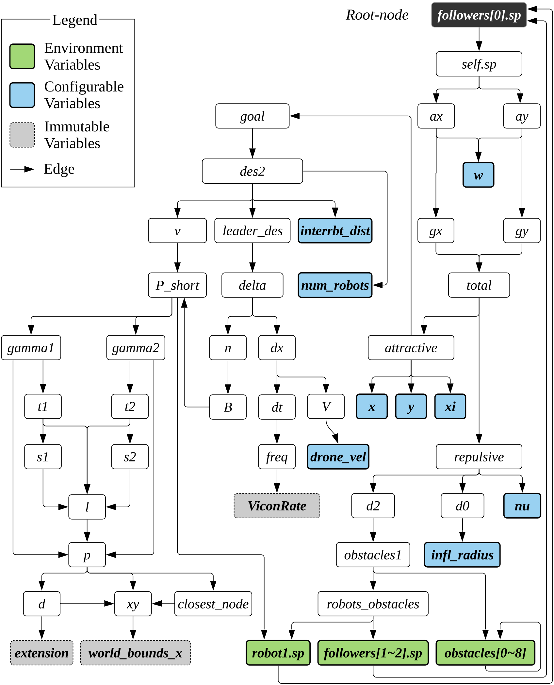

# Identifying configuration variables

This page presents detailed steps to identify configuration variables.

- **Step 1: Identifying causal source variables.**

  A swarm algorithm typically includes a number of variables as shown in above figure (a dependency graph generated from a variable holding a coordinate of a drone, i.e., the drone’s decision. The first step of the analysis is to identify variables that are causally related to the drones’ decision in a swarm. Specifically, we focus on variables that are _not derived by other variables_ (or we call source variables). We call them causal source variables. Note that, in this step, we obtain a list of causal source variables, not their contributions to the decision which requires complex program analysis.

  The causal source variables are identified as follows. First, we build a static dependency graph as shown in the above figure using a standard static dependency analysis. Note that the root node is a variable that representing a drone’s coordinates ( `followers[0].sp` ). Second, we focus on the variable on the leaf nodes (the nodes with background colors), which are typically defined with a constant value or a value from a configuration file (e.g., “variable = Constant or Config;”). In above figure, there are three types of such variables (on the leaf nodes): status, configurable, and immutable variables.

  1. **Status (green)**: If a variable is derived twice (hence forming a cycle in a bi-directional graph), we consider them status variables. Their values keep changing during the execution reflecting the current status of the drone.
  2. **Configurable (blue)**: Given a variable on a leaf node, if the variable’s value can be modified (i.e., changing the variable’s value definition), we consider them are configurable variables. They mostly have a simple pattern of “var = Constant-Value”.
  3. **Immutable (gray**): If changing a leaf node’s variable’s value causes an execution error (e.g., segmentation fault), we categorize them immutable variables, and remove them from our analysis

  Note that other variables that do not belong to the above three are simple derivatives of them (i.e., source variables). Status variables are a special kind of derivatives that is derived twice. In a swarm algorithm that is typically a closed-loop system, status variables often hold values from the previous loop (i.e., the previous tick), essentially representing the result of the last decision.

- **Step 2: Identifying environment configuration variables.**

  Among the status variables, we focus on variables representing environment objects (e.g., obstacles and other robots) because any objects exist in the same world can directly affect the swarm behavior and are crucial in understanding causes of bugs. To identify variables that represent environment objects, we essentially look for status variables that have the same data type as the root node’s variable, which represents the robot’s pose (i.e., coordinate).

  In above figure, all the status variables and the root node’s variable have the same data type, hence all the status variables (green nodes) are environment objects. Specifically, their data type is an array of a matrix: `robot[0]`, `robot[1]`, and `robot[2]` hold x, y, and z coordinates, respectively. There are three source variables for environment objects in above figure: `robot1.sp` , `followers[1-2].sp` , and `Obstacles[0-8]`.
